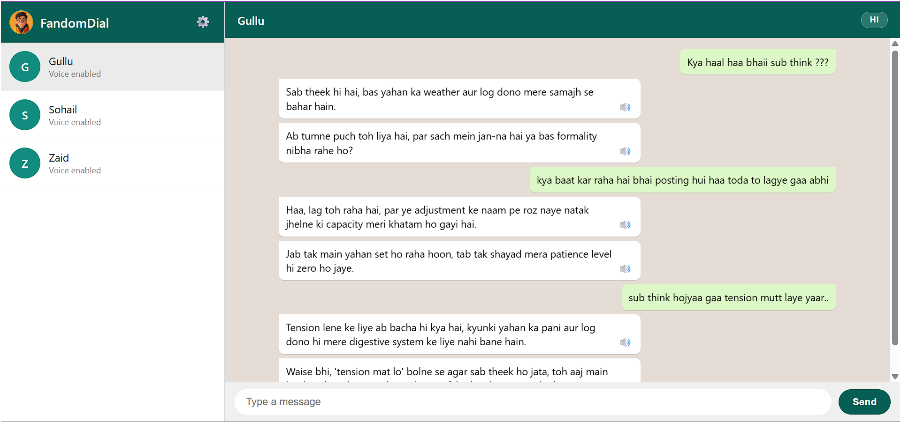

<p align="center">
  
</p>

<h1 align="center">FandomDial</h1>

<p align="center">
<strong>A voice for every character worth talking to.</strong>
</p>

<p align="center">
Chat with original AI characters that remember conversations, express unique personalities, and occasionally reply with realistic voice notes.
</p>

<p align="center">
  
  
  
  
  
</p>

<p align="center">

🚀 Built for the <strong>DEV Weekend Challenge — Passion Edition (2026)</strong>

</p>

---

# 🎥 Demo

> **Live Demo:** [https://fandomdial.onrender.com](https://fandomdial.onrender.com)
>
> Note: hosted on Render's free tier, which sleeps after ~15 minutes of inactivity. First load may take 30-50 seconds to wake up.

<p align="center">
  
</p>

### What you're seeing

The screenshot below demonstrates a live conversation with **Gullu**, one of FandomDial's original AI characters.

Responses are generated using Google Gemini, synthesized with ElevenLabs when voice is triggered, and delivered through a WhatsApp-inspired interface that preserves conversational memory.

---
## Table of Contents

- [Overview](#-overview)
- [Why We Built It](#-why-we-built-it)
- [Highlights](#-highlights)
- [Characters](#-meet-the-characters)
- [Architecture](#-architecture)
- [Engineering Decisions](#-engineering-decisions)
- [Project Structure](#-project-structure)
- [API](#-api-overview)
- [Running Locally](#-running-locally)
- [Design Decisions](#-design-decisions)
- [Roadmap](#-roadmap)
- [License](#-license)
---
# ✨ Overview

FandomDial is a WhatsApp-inspired conversational platform where users interact with **original AI characters**, each designed with a unique personality, speaking style, humor, and voice.

Unlike traditional AI chat applications, the goal isn't simply to answer questions—it's to create conversations that feel like messaging a real person.

Every character:

- 🧠 Remembers previous conversations
- 🎭 Responds according to a consistent personality
- 🎙️ Can send realistic voice notes
- 💬 Uses natural Hinglish conversations
- ⚡ Runs on a modular backend built with Clean Architecture

Rather than using existing fictional characters, FandomDial introduces completely original personalities designed specifically for this project.

---

# 💡 Why We Built It

Most AI character applications focus on existing franchises or generic roleplay.

We wanted to explore a different question:

> **Can original characters become memorable enough that people want to keep talking to them?**

This project serves as a proof of concept for a future platform where writers can publish original characters, gather real audience feedback, and validate ideas before investing in books, games, or films.

---

# 🚀 Highlights

- 🎭 Three original AI personalities
- 🎙️ Voice replies powered by ElevenLabs
- 🧠 Context-aware conversation memory
- ⚡ Async FastAPI backend
- 🔄 Provider-agnostic architecture
- 📉 Token-efficient context compression
- 🎵 Smart voice triggering
- 🔊 Audio caching
- 🛡️ Playback race-condition protection

---

# 🎭 Meet the Characters

Instead of reproducing copyrighted characters, FandomDial introduces three original personalities designed from scratch.

---

## 🟢 Gullu

> Quiet. Blunt. Dry. Brutally honest.

**Personality**

- Low-energy
- Deadpan humor
- Minimal words
- Doesn't sugarcoat anything

**Example**

**User**

> Bro, I've been coding for fourteen hours straight.

**Gullu**

> "Bhai... project complete hone se pehle tu khud maintenance mode mein chala jayega."

---

## 🔵 Sohail

> The childhood friend who questions every life decision.

**Personality**

- Friendly
- Curious
- Street-smart
- Helpful (unless money is involved)

**Example**

**User**

> I'm quitting my job tomorrow.

**Sohail**

> "Achha... plan kya hai? Savings kitni hain? Aur sabse important... kal se khaayega kya?"

---

## 🟠 Zaid

> Every problem has a shortcut. Even when it absolutely shouldn't.

**Personality**

- Loud
- Confident
- Reckless
- King of jugaad

**Example**

**User**

> I scratched my landlord's new car.

**Zaid**

> "Simple hai. Pehle panic mat kar. Doosra... toothpaste la."

---
# 🏛️ Architecture

FandomDial is built using **Hexagonal Architecture (Ports & Adapters)** with **SOLID principles**. The application's business logic never depends directly on external AI providers, voice services, or storage implementations.

Instead, every external dependency is accessed through an abstraction, making the system easier to test, extend, and maintain.

```text
                         Frontend
                  (HTML • CSS • JavaScript)
                              │
                              ▼
                     FastAPI REST API
                              │
                     Dependency Injection
                              │
            ┌─────────────────┴─────────────────┐
            ▼                                   ▼
      ChatService                        VoiceService
            │                                   │
      ┌─────┴─────┐                     ┌───────┴───────┐
      ▼           ▼                     ▼               ▼
 CharacterRepo SessionStore        AIProvider     VoiceProvider
      │           │                     │               │
      ▼           ▼                     ▼               ▼
 Characters   In-Memory Store      Google Gemini   ElevenLabs
```

### Why this architecture?

Large Language Models evolve rapidly.

Voice providers change.

Storage requirements grow.

Instead of tightly coupling the application to one vendor, FandomDial communicates only through interfaces (`AIProvider`, `VoiceProvider`, and `SessionStore`).

This allows providers to be replaced without changing the application's business logic.

For example:

- Replace Google Gemini with another LLM.
- Replace ElevenLabs with a self-hosted TTS engine.
- Replace the in-memory session store with Redis or PostgreSQL.

Each change only requires a new adapter while the rest of the application remains unchanged.

---

# 🧠 Engineering Decisions

One of the goals of this project was to solve problems that appear in real AI applications—not just connect APIs together.

---

## 📉 1. Context Management

### Problem

Sending the entire conversation history to the LLM on every request quickly increases latency, token usage, and cost.

### Solution

A rolling context builder summarizes older conversations while preserving the most recent exchanges.

The frontend still displays the complete conversation, but the AI receives:

- A compact summary of older messages
- The latest conversation turns
- The current user message

This keeps context relevant while maintaining predictable token usage.

---

## 🎙️ 2. Voice Provider Compatibility

### Problem

During development, ElevenLabs returned an unexpected **HTTP 402** response when attempting to use community Voice Library models from the free tier.

### Solution

Instead of hardcoding voice IDs, the application dynamically loads voices available to the authenticated account and assigns the best match for each character.

This makes deployments more portable across different developer accounts.

---

## 🎲 3. Smart Voice Triggering

### Problem

Generating voice for every response quickly consumes API quotas and makes conversations feel unnatural.

Real people don't send voice notes after every message.

### Solution

A dedicated `VoiceTriggerDecider` determines when a reply should become a voice note.

Approximately 20% of responses are converted into audio, creating a more natural messaging experience while dramatically reducing API usage.

---

## 🔊 4. Safe Audio Playback

### Problem

Rapid user interaction can produce overlapping audio if multiple requests complete out of order.

### Solution

Each audio request receives a unique ticket.

Only the newest ticket is allowed to trigger playback.

Older responses are discarded automatically.

Previously generated audio is also cached locally, preventing duplicate API calls for the same message.

---

## ⚡ 5. Perceived Performance

### Problem

LLM generation and text-to-speech introduce unavoidable network latency.

Without feedback, users perceive the application as frozen.

### Solution

The interface immediately displays typing indicators.

If generation exceeds a short threshold, lightweight filler audio is played while the actual response is being generated.

The filler stops automatically as soon as the real voice note becomes available.

This small interaction significantly improves perceived responsiveness without affecting backend performance.

---

# 🎯 Design Trade-offs

Hackathons require making deliberate engineering decisions.

The following limitations were intentionally accepted to keep the application reliable within a weekend build.

### In-Memory Session Storage

Conversation history is currently stored in memory and resets when the server restarts.

Because storage is accessed through the `SessionStore` interface, migrating to Redis or PostgreSQL requires only a new implementation—not changes to the business logic.

---

### Voice Quality

The free ElevenLabs tier limits access to certain voices.

The project currently uses account-available models that speak Hinglish naturally, although pronunciation can occasionally reflect their English training.

Custom voice cloning is planned for a future iteration.

---

### Voice Notes Instead of Calls

Real-time voice conversations require streaming speech recognition, streaming LLM inference, streaming synthesis, and WebRTC.

For a weekend project, asynchronous voice notes provided a simpler, more reliable experience while preserving the feel of modern messaging applications.

---
# 📂 Project Structure

FandomDial follows a modular architecture that separates business logic from external integrations. This keeps the core application independent of AI providers, voice engines, and storage implementations.

```text
FandomDial
│
├── app/
│   ├── models/
│   ├── providers/
│   ├── repositories/
│   ├── routers/
│   ├── services/
│   ├── storage/
│   ├── config.py
│   └── main.py
│
├── frontend/
│   ├── audio/
│   ├── app.js
│   ├── index.html
│   └── style.css
│
├── images/
│   └── cc.png
│
├── app_test/
│
├── requirements.txt
├── README.md
└── .env.example
```

This separation allows infrastructure components to evolve independently while keeping the domain layer focused purely on application behavior.

---

# 🌐 API Overview

The frontend communicates with the backend through a small REST API.

| Method | Endpoint | Description |
|---------|----------|-------------|
| `GET` | `/api/characters` | List all available characters |
| `POST` | `/api/chat/send` | Send a message and receive a character's reply (as bubble-split text) |
| `GET` | `/api/voice/stream` | Stream synthesized voice audio for a given character and text |

**Example — `POST /api/chat/send`**

Request:
```json
{
  "session_id": "session_al0kobt4ub7",
  "character_id": "gullu",
  "user_name": "Adil",
  "text": "Bro, my interview didn't go well.",
  "language": "hi"
}
```

Response:
```json
{
  "status": "success",
  "reply": "Interview gaya... ab chai pee.",
  "reply_bubbles": ["Interview gaya...", "ab chai pee."],
  "auto_voice": false
}
```

**Example — `GET /api/voice/stream`**

```
GET /api/voice/stream?character_id=gullu&text=Interview+gaya...+ab+chai+pee.
```

Returns raw `audio/mpeg` bytes (played directly by the frontend `<audio>` pipeline).

---

# ⚙️ Running Locally

## Clone the repository

```bash
git clone https://github.com/FanoyG/fandomdial.git

cd fandomdial
```

---

## Create a virtual environment

```bash
python -m venv .venv
```

Activate it.

Windows

```bash
.venv\Scripts\activate
```

Linux / macOS

```bash
source .venv/bin/activate
```

---

## Install dependencies

```bash
pip install -r requirements.txt
```

---

## Configure environment variables

Create a `.env` file.

```env
GEMINI_API_KEY=your_key_here
ELEVENLABS_API_KEY=your_key_here
```

---

## Start the application

```bash
uvicorn app.main:app --reload
```

Open

```
http://127.0.0.1:8000
```

---

# 💭 Design Decisions

Every technical decision in this project was made intentionally.

### Why FastAPI?

Its asynchronous architecture makes it well suited for concurrent AI requests and voice generation while keeping the codebase simple.

---

### Why Hexagonal Architecture?

AI providers evolve rapidly. By depending on interfaces instead of SDKs, the application can swap providers without changing business logic.

---

### Why Vanilla JavaScript?

A modern frontend framework would have increased setup time without adding value for this MVP.

Plain HTML, CSS, and JavaScript kept the project lightweight and focused on the backend architecture.

---

### Why Original Characters?

Rather than reproducing copyrighted fictional characters, FandomDial explores whether entirely original personalities can become memorable through conversation alone.

---

### Why Voice Notes Instead of Calls?

Real-time voice conversations require streaming speech recognition, streaming LLM inference, WebRTC, and streaming text-to-speech.

Voice notes deliver a similar experience while remaining achievable within a weekend hackathon.

---

# 🛣️ Roadmap

Future iterations will focus on turning FandomDial into a creator platform.

- [ ] Redis session persistence
- [ ] PostgreSQL support
- [ ] Character SDK
- [ ] Writer dashboard
- [ ] Audience analytics
- [ ] Custom voice cloning
- [ ] Real-time voice conversations
- [ ] Character marketplace

---

# 🙏 Acknowledgements

Built with:

- Google Gemini
- ElevenLabs
- FastAPI
- Python

Created for the **DEV Weekend Challenge – Passion Edition (2026).**

---

# 📄 License

This project is licensed under the **MIT License**.

---

<div align="center">

**If you enjoyed this project, consider giving it a ⭐**

Built over one weekend using Python, FastAPI, Google Gemini and ElevenLabs.

</div>